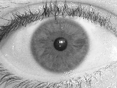
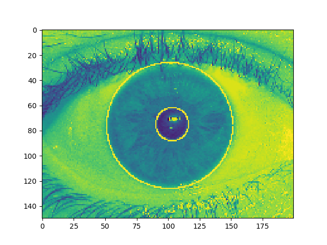

# irisSeg

Segementation of iris and pupil.

## Daugman algorithm:

`where I(x,y) is the eye image, r is the radius to searches over the image (x,y), G(r) is a Gaussian smoothing function.
The algorithm starts to search from the pupil, in order to detect the changing of maximum pixel values
(partial derivative).`

# Installation
    pip install irisSeg

# Usage

    from irisSeg import irisSeg
    import matplotlib.pyplot as plt
    #
    # you can also view using the argument in irisSeq function
    #
    coord_iris, coord_pupil, output_image = irisSeg('UBIRIS_200_150_R/Sessao_1/1/Img_1_1_1.jpg', 40, 70)
    print(coord_iris) # radius and the coordinates for the center of iris 
    print(coord_pupil) # radius and the coordinates for the center of pupil 
    plt.imshow(output_image)
    plt.show()

# use as a commandline tool

    >>iris-seg file_path min_radius max_radius

# References

1. `https://www.diva-portal.org/smash/get/diva2:831173/FULLTEXT01.pdf`
2. `https://uk.mathworks.com/matlabcentral/fileexchange/15652-iris-segmentation-using-daugman-s-integrodifferential-operator`
